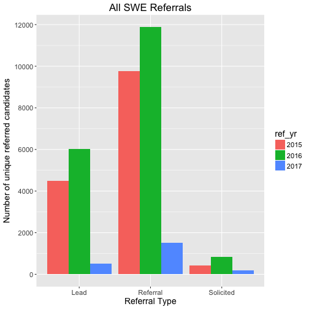

**Contents**

[TOC]


### Goals

Inform recruiting strategy for SWE experienced candidates. Clients are Lori, EQ, Miranda, Jay, Nadir.

### Descriptives


```
## Warning: package 'ggplot2' was built under R version 3.3.2
```

This plot shows the number of unique lead candidates, referrals, and solicits in 2015, 2016, and YTD.




### Referral Definitions

A referral is categorized into three groups:

- Strong referral - of "referral" type, which is determined by FB's referral tool + the referrer explicitly vouches for the candidate's professional competency
- Weak referral - any lead, solicit, or referral that is *not* a strong referral
- No referral - any lead, solicit, or referral that was submitted more than 50 days after their app is created or more than 365 days before their app is created

To define a referred *candidate*, my definitions are the following:

- Strongly referred - the candidate received only strong referrals
- Weak candidate - the candidate is not strongly referred but received at least one weak referral
- Never referred - either never referred through the referral tool, or referrals sent through the tool for this candidate fell outside the time band of interest

I then allow a candidate to fall in one of the above buckets for *each year* (2015, 2016, 2017 YTD).


### Key Takeaways

- Experienced SWE candidates that are hired through referrals perform better in their second PSC cycle ()
- Their app creation to offer extend times take stat. sig. fewer days compared to non-referrals (median diff ~ 1 week)
- Referred candidates get offers at a significantly higher rate (~8% compared to 3% for non-referrals), with strictly referred candidates receiving offers at a slightly higher rate than weakly referred
- Referrers with more seniority refer higher performing candidates

### Follow-ups

- All Tech
- All FB
- Promotion rates
