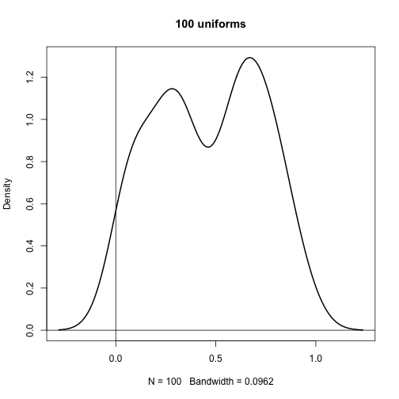
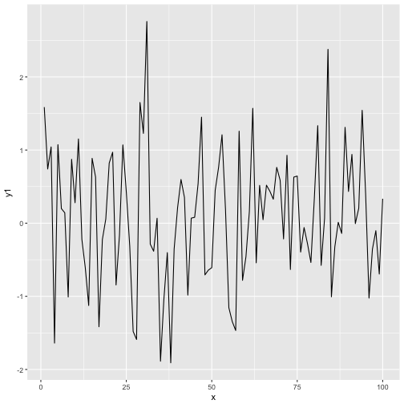
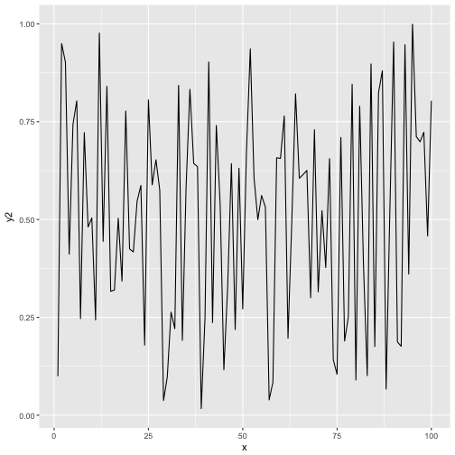

**Contents**

[TOC]

### Executive Summary

Here is the summary of the work we've done. 

### 2016_Q3 Results

Here is some code to make a plot:


```r
plot(density(runif(100)), lwd=2, main="100 uniforms")
abline(h=0, v=0)
```




### Key Takeaways

What we learned is:

 - There should be one plot display call in each R block. The add_knowledge script currently gets confused if there are multiple plots in a given block:


```r
  ### My Header (treated as R comment, as it is in a code block)
  library(ggplot2)
```

```
## Warning: package 'ggplot2' was built under R version 3.3.2
```

```r
  test_data <- data.frame(y1 = rnorm(100), y2 = runif(100), x = 1:100)
  ggplot(test_data, aes(y = y1, x = x)) + geom_line()
```



```r
  ggplot(test_data, aes(y = y2, x = x)) + geom_line()
```



 - Do not put markdown headers in R blocks. The knitr code will interpret the header #'s as R comments. This means that they will either be rendered properly as R comments within the block, or left out entirely if echo=FALSE

### Appendix

Here is some more detail if you're interested:
